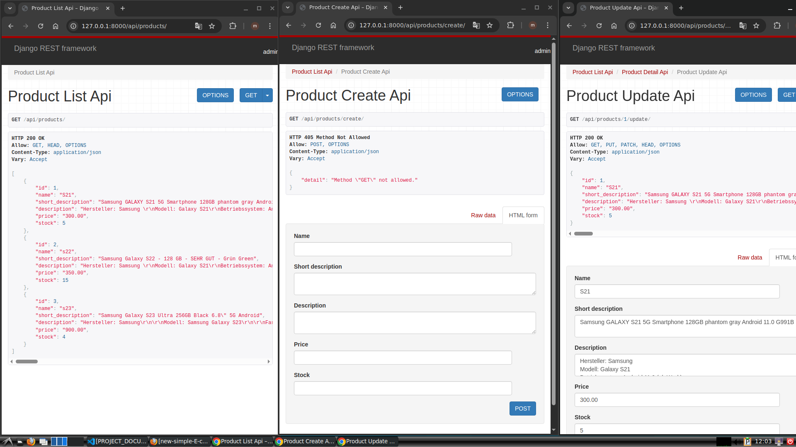

# Muckie E-Commerce



Muckie E-Commerce is a Django-based web application designed to manage and showcase products for an online store. This project includes features for product management, API endpoints, and a database for storing product information.

## Features
- Product management (CRUD operations)
- RESTful API for product data
- SQLite database integration
- Modular app structure

## Installation

1. Clone the repository:
   ```bashj
   git clone <repository-url>
   ```

2. Navigate to the project directory:
   ```bash
   cd muckie-e-commerce
   ```

3. Install dependencies:
   ```bash
   pip install -r requirements.txt
   ```

4. Apply migrations:
   ```bash
   python manage.py migrate
   ```

5. Run the development server:
   ```bash
   python manage.py runserver
   ```

6. Access the application at `http://127.0.0.1:8000/`.

## Project Structure

```
project/
    __init__.py
    asgi.py
    settings.py
    urls.py
    wsgi.py
products/
    __init__.py
    admin.py
    api.py
    apps.py
    models.py
    serializers.py
    tests.py
    urls.py
migrations/
    ...
manage.py
requirements.txt
```

## Contributing

Contributions are welcome! Please fork the repository and submit a pull request.

## License

This project is licensed under the MIT License.